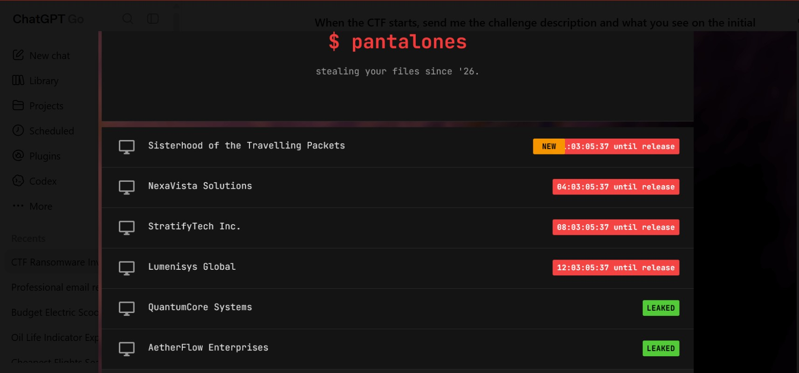
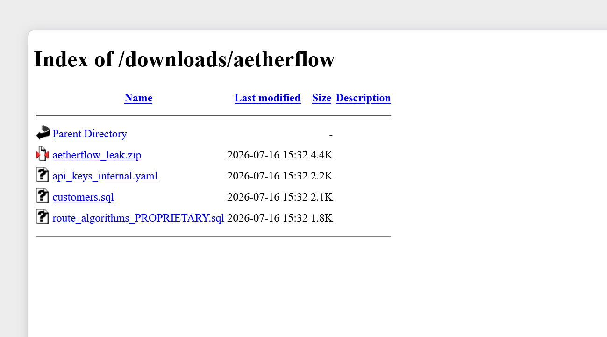
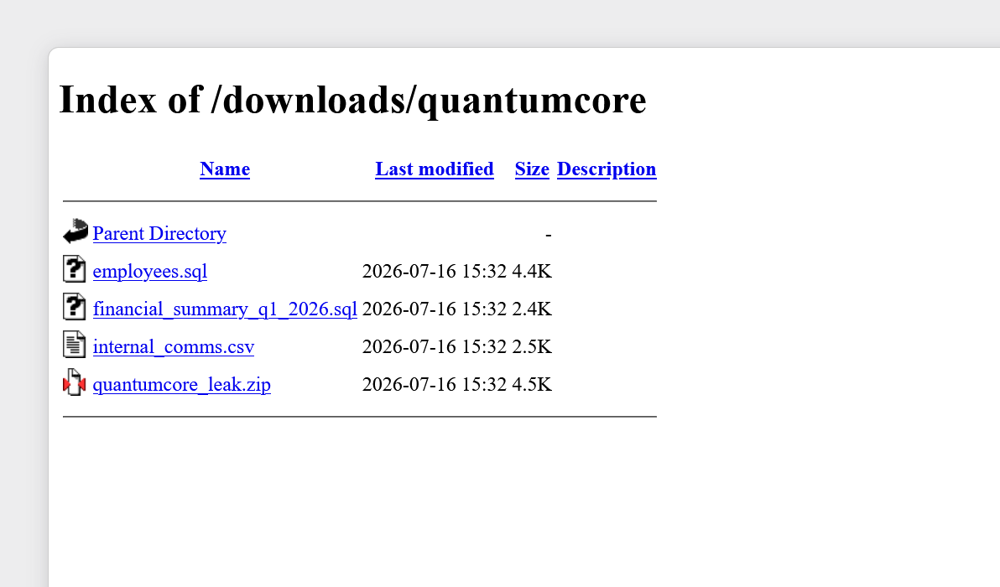
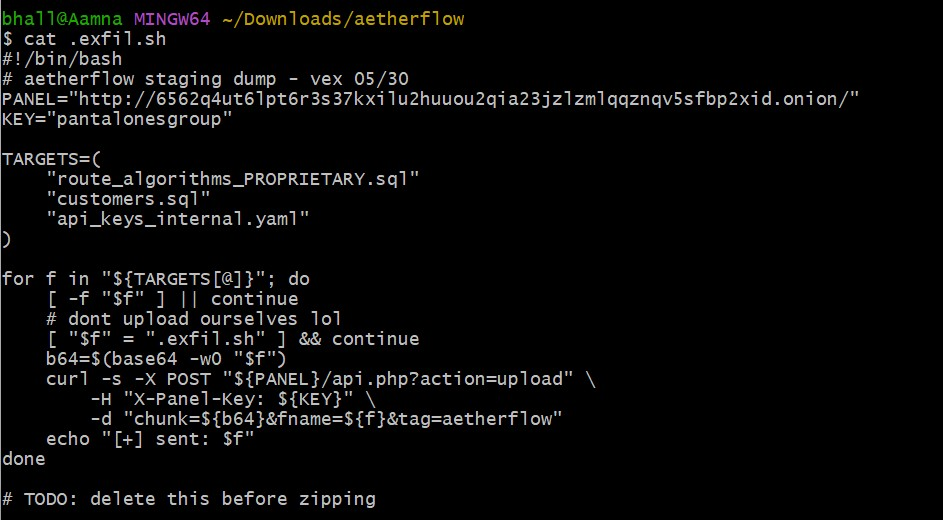
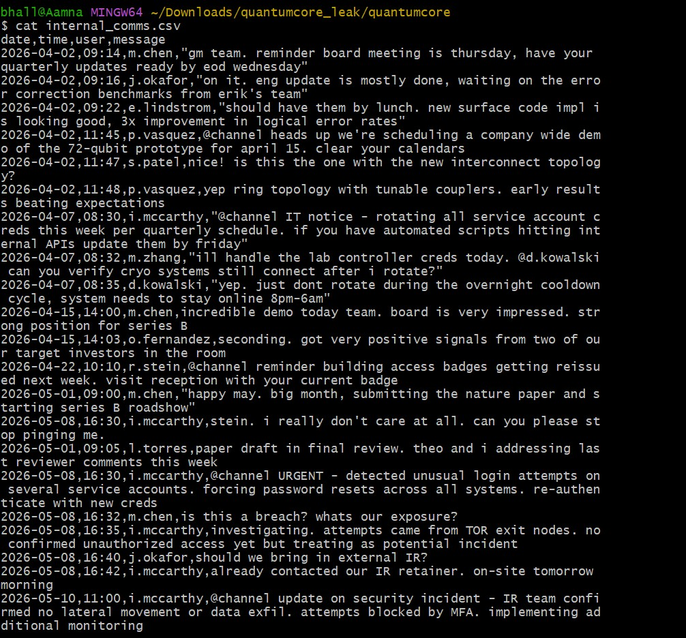
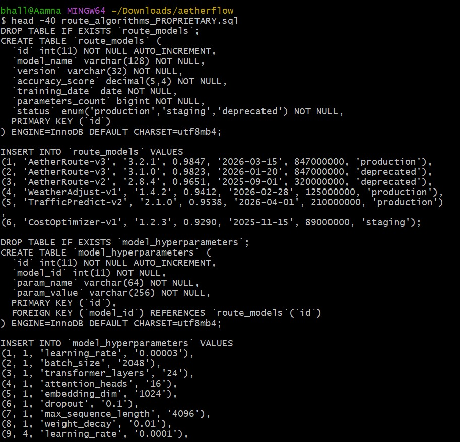

# Sisterhood of the Travelling Packets — CTF Writeup

> Beginner web/forensics CTF focused on ransomware infrastructure, OPSEC failures, web enumeration, and credential discovery.

## Challenge Overview

The challenge presents a simulated ransomware leak website operated by a group called **Pantalones**.

The objective is to investigate the website and its leaked files, identify operational-security mistakes made by the attackers, and ultimately retrieve the flag.

The flag format is:

`flare{...}`

---

# 1. Initial Reconnaissance

The first step was simply to explore the website.

The main page contained navigation links to:

- `index.php`
- `crew.php`
- `about.php`



The `crew.php` page identified four members of the fictional ransomware collective:

| Username | Role |
|---|---|
| vex | operator / panel dev |
| crypt | payload engineer |
| mora | negotiations |
| skid | initial access |

This gave us useful context about the fictional threat actor.

---

# 2. Checking robots.txt

One of the first files worth checking during web reconnaissance is:

`/robots.txt`

`robots.txt` is intended to provide instructions to search-engine crawlers. It is not an access-control mechanism.

In this challenge, checking it revealed interesting application paths, including the API and administrative interface.

The two particularly important paths were:

```text
/api.php
/admin.php
```

This immediately gave us two areas of the application to investigate.

---

# 3. Investigating the Leak Files

The website also provided downloadable leak archives.

The AetherFlow archive contained files including:

```text
api_keys_internal.yaml
customers.sql
route_algorithms_PROPRIETARY.sql
```


The QuantumCore archive contained:

```text
employees.sql
financial_summary_q1_2026.sql
internal_comms.csv
```


The files appeared to contain realistic corporate information.

However, one of the important clues from the challenge was to inspect the archives carefully, including hidden files.

Using:

```bash
ls -la
```

revealed a hidden file:

```text
.exfil.sh
```

The `-a` option causes hidden files to be displayed.

---

# 4. The Hidden Exfiltration Script

The `.exfil.sh` file was a shell script used to send stolen files to the ransomware group's infrastructure.

Reading the file rather than executing it revealed several important details.



The script contained a panel URL and a panel key.

It also referenced:

```text
/api.php?action=upload
```

This confirmed that the attackers had an API for handling their stolen data.

The most significant OPSEC mistake was that the attackers had accidentally included their own infrastructure information inside a leak archive they had published.

The script even contained a comment indicating that it should have been deleted before the archive was created.

---

# 5. Accessing the API Through Tor

The `.onion` infrastructure needed to be accessed through Tor.

When using `curl`, a normal request such as:

```bash
curl "http://<onion-address>/api.php"
```

failed because normal DNS resolution does not handle `.onion` addresses.

Tor Browser exposes a local SOCKS proxy. In this environment it was available at:

```text
127.0.0.1:9150
```

Therefore the request was made with:

```bash
curl --socks5-hostname 127.0.0.1:9150 \
"http://<onion-address>/api.php"
```

The important part is:

```text
--socks5-hostname 127.0.0.1:9150
```

which tells `curl` to send the connection through the Tor SOCKS5 proxy.

---

# 6. Discovering the API

Requesting `api.php` without parameters produced an error:

```json
{
  "error": "missing required parameter: action",
  "valid_actions": [
    "upload",
    "status",
    "messages",
    "decrypt",
    "wallets",
    "payloads",
    "exfil"
  ]
}
```

This was a major information disclosure.

The application itself told us which API actions existed.

For example:

```text
/api.php?action=status
```

returned information about the panel.

The API did not require authentication for several of these informational endpoints.

---

# 7. Investigating the Messages Endpoint

Requesting:

```text
/api.php?action=messages
```

produced another useful error:

```json
{
  "error": "missing required parameter: conversation_id"
}
```

This told us that the API expected another parameter.

We therefore requested a conversation using:

```text
/api.php?action=messages&conversation_id=1
```

The API returned internal messages between members of Pantalones.



This was another major OPSEC failure: sensitive internal communications were accessible through the API.

---

# 8. Enumerating Conversations

The API used a numeric `conversation_id`.

We tested additional IDs, including:

```text
conversation_id=2
conversation_id=3
```

This is an example of enumeration: systematically checking predictable identifiers to discover available resources.

Conversation 2 contained an especially useful exchange.

Mora asked for the password to an FTP server.

Crypt replied with a Base64-encoded string:

```text
UGFudGFsMG4zc19SdWwzeiE=
```

Crypt described it as Mora's password.

---

# 9. Decoding the Password

The string looked like Base64.

Base64 is an encoding scheme, not encryption.

Decoding:

```text
UGFudGFsMG4zc19SdWwzeiE=
```

produced:

```text
Pantal0n3s_Rul3z!
```

This represented another serious OPSEC failure:

- a password was shared in internal chat;
- the password was merely encoded rather than encrypted;
- the password was associated with a real crew member.

---

# 10. Investigating admin.php

The API investigation and the application's own reconnaissance clues pointed toward:

```text
/admin.php
```

Visiting it revealed an administrative login page.

The login requested:

```text
Username
Password
```

An initial attempt using the panel key found in `.exfil.sh` did not work as an administrator password.

The recovered credential from the internal conversation was then tested against the appropriate crew account.

The credentials were accepted.

---

# 11. Accessing the Admin Dashboard

The login request was reproduced using `curl`:

```bash
curl --socks5-hostname 127.0.0.1:9150 -i \
  -c cookies.txt \
  --data-urlencode "username=mora" \
  --data-urlencode "password=<REDACTED>" \
  "http://<onion-address>/admin.php"
```

The `-c cookies.txt` option saves cookies returned by the server.

This is important because PHP applications commonly use a session cookie to remember that a user has authenticated.

The response returned the administrative dashboard.

---

# 12. Finding the Flag

The admin dashboard contained a table of victims, ransom amounts, statuses, and decryption keys.

The row for:

```text
Sisterhood of the Travelling Packets
```

contained the challenge flag in the decryption-key field.

The flag was:

```text
flare{pantal0n3s_g0t_pantsed_2026}
```

---

# 13. Key OPSEC Failures

The challenge demonstrated several common security mistakes.

### 1. Sensitive paths exposed through reconnaissance

`robots.txt` revealed paths that should not have been considered secret.

### 2. Hidden files included in a public archive

The attackers believed `.exfil.sh` would probably not be noticed.

However:

```bash
ls -la
```

revealed it immediately.

### 3. Infrastructure details embedded in the script

The script contained information about the attackers' panel and authentication mechanism.

### 4. Sensitive API endpoints exposed

`api.php` revealed its supported actions.

### 5. Internal communications exposed

Conversation IDs could be enumerated to retrieve attacker communications.

### 6. Credentials shared in chat

A crew member's password was directly shared through internal messages.

### 7. Base64 mistaken for protection

Base64 is encoding, not encryption.

Anyone who recognizes it can decode it easily.

### 8. Credential reuse / weak credential hygiene

A recovered crew credential was sufficient to access the administrative interface.

### 9. Security through obscurity

The operators believed that placing the administration panel behind Tor was sufficient protection.

Tor can provide anonymity/network routing, but it does not replace authentication and authorization.

---

# 14. Lessons Learned

The most important lesson from the challenge was to enumerate before exploiting.

A useful workflow for beginner web CTFs is:

```text
1. Explore the website
2. Inspect source
3. Check common files such as robots.txt
4. Look for hidden files
5. Identify interesting endpoints
6. Understand parameters
7. Read error messages carefully
8. Enumerate predictable identifiers
9. Investigate leaked credentials
10. Test discovered functionality
11. Document every clue
```

The challenge did not require a complicated exploit chain.

Instead, it relied on attackers repeatedly making small OPSEC mistakes until those mistakes could be chained together.

---

# Flag

```text
flare{pantal0n3s_g0t_pantsed_2026}
```

---

## Additional OPSEC Findings

The downloadable archives contained additional evidence of poor operational security.



The AetherFlow archive included:

- `api_keys_internal.yaml`
- `customers.sql`
- `route_algorithms_PROPRIETARY.sql`
- hidden `.exfil.sh`

The QuantumCore archive included:

- `employees.sql`
- `financial_summary_q1_2026.sql`
- `internal_comms.csv`

The internal communications were particularly useful because they provided context about the operators and revealed that they were aware of some of their own security mistakes.

For example, the operators discussed the fact that `.exfil.sh` had been accidentally left inside an archive.

This reinforces the main theme of the challenge: the attackers' biggest weakness was not necessarily a sophisticated technical vulnerability, but repeated failures in operational security.
